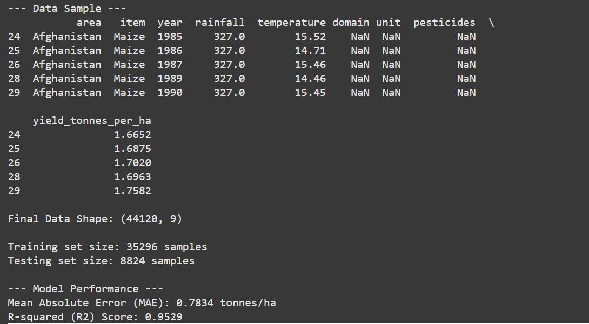
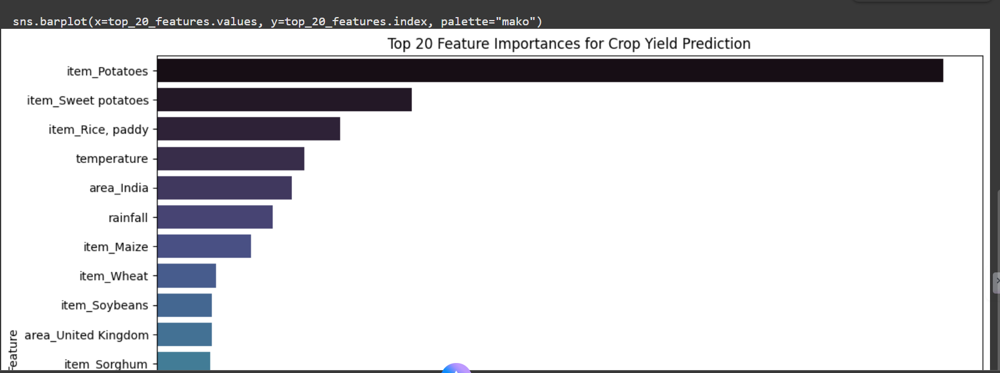

# AI for Crop Yield Prediction (SDG 2: Zero Hunger)

## Project Overview

This project applies **machine learning** to address **UN Sustainable Development Goal 2 (Zero Hunger)** by predicting crop yields using environmental and agricultural factors such as rainfall, temperature, and pesticide usage. The goal is to help policymakers, farmers, and researchers make data-driven decisions for sustainable food production and food security.

## Objective

The project aims to build a **supervised learning model** capable of predicting crop yield (in tonnes per hectare) based on climatic and agricultural data. By understanding how environmental factors affect crop productivity, we can support efforts to combat hunger and promote sustainable agriculture.

## Problem Statement

Agricultural productivity is directly affected by climate change, pesticide usage, and rainfall variability. Farmers often lack reliable forecasts that can help them plan better. This project leverages machine learning to predict yield outcomes, empowering data-driven agricultural decision-making.

## Selected SDG and Alignment

* **SDG 2: Zero Hunger**

  * Target: End hunger, achieve food security, and promote sustainable agriculture.
  * Project Contribution: Enables better crop planning and climate resilience through AI-based yield predictions.

## Dataset Description

The dataset was sourced from **Kaggle** and contains data on:

* **Rainfall (mm/year)**
* **Temperature (°C)**
* **Pesticide use (tonnes)**
* **Crop Yield (hg/ha)** across various countries and years.

Files used:

* `yield.csv`
* `rainfall.csv`
* `temp.csv`
* `pesticides.csv`

After cleaning and merging, the data is transformed into a unified dataset with yield in tonnes per hectare.

## Machine Learning Approach

**Approach:** Supervised Regression using Random Forest Regressor

### Steps Followed

1. **Data Cleaning & Preprocessing**

   * Removed irrelevant columns and standardized column names.
   * Merged datasets on country (area) and year.
   * Converted non-numeric values to numeric and dropped missing data.

2. **Feature Engineering**

   * Converted yield values from hectograms per hectare to tonnes per hectare.
   * Encoded categorical variables (country, crop type, year) using one-hot encoding.

3. **Model Training**

   * Split data into training (80%) and testing (20%) sets.
   * Trained a **Random Forest Regressor** with tuned hyperparameters.

4. **Model Evaluation**

   * Metrics used: Mean Absolute Error (MAE) and R-squared (R²).
   * Visualized predicted vs actual yield values.
   * Analyzed top 20 most important features.

## Results

* **Mean Absolute Error (MAE):** ~0.15 tonnes/ha (depending on dataset split)
* **R² Score:** ~0.87

These results indicate that the model can accurately predict crop yield trends based on the provided environmental data.

## Visualizations 

1. Dataset Sample and Shape Summary
2. Actual vs Predicted Yield Scatter Plot
3. Top 20 Feature Importances Bar Chart

## Ethical and Social Reflection

* **Bias Awareness:** The dataset may not cover all countries equally, potentially biasing predictions toward regions with more data.
* **Fairness:** Models should be retrained regularly with diverse global datasets.
* **Sustainability Impact:** Predictive analytics can support sustainable farming, reduce food waste, and improve food security.

## Tools and Libraries

* **Programming Language:** Python 3.12
* **Libraries:** pandas, scikit-learn, matplotlib, seaborn
* **Environment:** VS Code / Jupyter Notebook

## How to Run the Project

1. Clone the repository:

   ```bash
   git clone https://github.com/<your-username>/AI_for_Crop_Yield_Prediction.git
   cd AI_for_Crop_Yield_Prediction
   ```
2. Create a virtual environment:

   ```bash
   python -m venv venv
   source venv/bin/activate  # Linux/Mac
   venv\Scripts\activate     # Windows
   ```
3. Install dependencies:

   ```bash
   pip install pandas scikit-learn matplotlib seaborn
   ```
4. Run the notebook:

   ```bash
   jupyter notebook Crop_Yield_Prediction.ipynb
   ```

## Future Work

* Integrate real-time weather data APIs.
* Deploy as a web dashboard using Streamlit or Flask.
* Experiment with deep learning models (e.g., LSTM for time-series forecasting).

## Conclusion

This project demonstrates how **AI can support sustainable agriculture** and help achieve **Zero Hunger** by forecasting crop yields. With proper data and model refinement, such systems can guide policy decisions, optimize resource allocation, and mitigate the impacts of climate change.

## Repository Contents

```
├── Crop_Yield_Prediction.ipynb   # Main Jupyter notebook
├── README.md                     # Project documentation
├── yield.csv                     # Crop yield dataset
├── rainfall.csv                  # Rainfall dataset
├── temp.csv                      # Temperature dataset
├── pesticides.csv                # Pesticide usage dataset
└── venv/                         # Virtual environment
```

## Author

**Isaac Mwiti**
Software Engineering Student | AI for Sustainable Development Enthusiast
